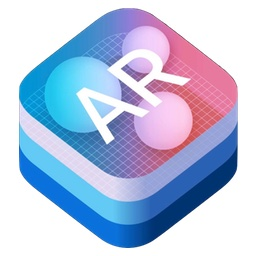

# ARKit Code Snippets

Random code snippets while learning [ARKit](https://developer.apple.com/arkit/) - the iOS Augmented Reality framework.

### Rotating Earth & Particle System of Stars

Go to ... __Snippets/RotatingEarth__

* Uses a custom 3D model of Earth created in [Blender](https://www.blender.org) (an open-source 3D modeling suite) using [NASA's Earth at Night imagery](https://www.nasa.gov/topics/earth/earthday/gall_earth_night.html) as a model texture.
* Adds the 3D model of Earth to the AR scene.
* Positions and Rotates the 3D model of the Earth in the AR scene.
* Adds a particle system to the AR scene to simulate space.

Design & Development notes [can be viewed here](Snippets/RotatingEarth/README.md).

### Touching Objects in an Augmented Reality Scene

Go to ... __Snippets/ARTouchGesture__

* Uses a custom 3D model of a fire wood creatd in [Blender](https://www.blender.org) (an open-source 3D modeling suite) and exported in Collada (.dae) format.
* Adds the fire wood to the AR scene.
* If User touches the 3D model of fire wood, a particle system of fire is added to the AR scene.  
* An audio file (mp3) of fire burning & crackling is played.

... more on the way ...

## Connect

* Twitter: [@clintcabanero](http://twitter.com/clintcabanero)
* GitHub: [ccabanero](http:///github.com/ccabanero)
